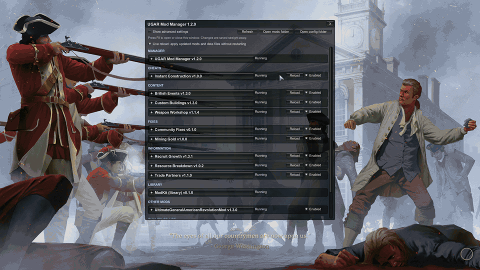

# UGAR Mod Pack

Mods made for **Ultimate General: American Revolution** (Steam, Windows), built on BepInEx 6 (IL2CPP).
Not affiliated with or endorsed by Game-Labs. Contains no game files.

Full video (no sound): [Full tour, part 1](docs/images/mod-pack-tour-1.mp4) (3 min) · [Full tour, part 2](docs/images/mod-pack-tour-2.mp4) (1 min)

## Install

1. **[Download UGAR-ModPack.zip](https://github.com/gyasigit/UGAR-Modding/releases/latest/download/UGAR-ModPack.zip)** (latest version; all versions are on the [Releases](https://github.com/gyasigit/UGAR-Modding/releases) page).
2. Close the game, unzip the whole package anywhere and double-click `Install.bat`.
3. Start the game from Steam (the first start after installing BepInEx takes a few extra minutes) and press **F8** for the mod manager.

To update, run `Install.bat` from a newer package; to remove everything, run `Uninstall.bat`.
Full player instructions: [src/Installer/README.txt](src/Installer/README.txt).

## For developers

| Folder | What |
|---|---|
| `src/` | One folder per mod (BepInEx plugins), the in-game mod manager, ModKit (library for other modders) and the player installer |
| `docs/` | How each mod works and the modder guide ([docs/modkit.md](docs/modkit.md)) |
| `tools/` | `build-dist.ps1` builds the player zip, `deploy-mod.ps1` installs one mod into a running game |

Build the player package: `powershell -ExecutionPolicy Bypass -File tools\build-dist.ps1 -Version x.y.z`
(needs the .NET SDK and the game with BepInEx run once, for the interop assemblies).
