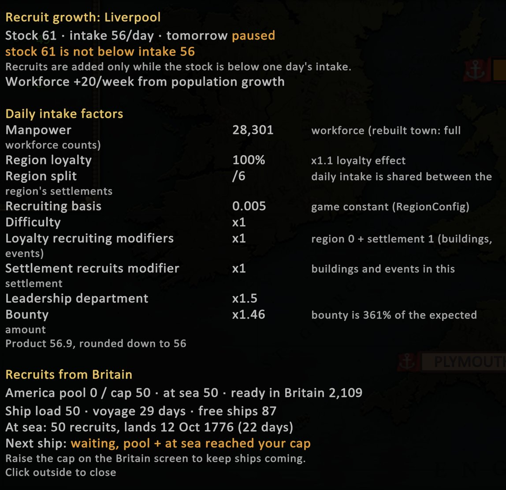

# Recruit Growth

Shows how many recruits each of your settlements gains per day, why, when growth is paused, and when the next recruits
from Britain arrive. It only reads the game's numbers and changes nothing in your campaign.



## How to use it

Everything uses the game's own tooltip style.

**Hover a settlement's recruits number** (on the settlement card). The game's recruits tooltip gets a short
"Recruit growth" section: daily intake, tomorrow's gain or why it's paused, and for Great Britain settlements two lines
about shipments from Britain.

**Click that number** to pin a popover beside the settlement panel with the full details:

- **Stock**, **daily intake** (plus any recruiting-policy bonus) and **tomorrow's** exact gain, or why it's paused.
- **Workforce growth** per week from population growth, which slowly raises the intake.
- **Custom buildings** from the [Custom Buildings](custom-buildings.md) mod in that settlement and their effects.
- **Daily intake factors**: everything the game multiplies together (manpower, region loyalty, sharing between the
  region's settlements, recruiting basis, difficulty, building and event modifiers, Leadership department, bounty).
- For Great Britain settlements, the **Recruits from Britain** section (below).

**Hover the population number in the top bar** for tomorrow's national total. **Click it** to pin an overview of every
settlement (stock / intake / tomorrow) plus the full Britain section.

**Colonial recruits on the top bar** (British campaigns): an extra icon and number next to the population number shows
the total recruits waiting in your settlements in America. Click it for the per-town list plus the America pool,
recruits at sea and recruits waiting in Britain. It's hidden on the England screen.

Click outside a popover or press **Escape** to close it.

### Recruits from Britain (British campaign)

- The America pool your regiments draw on, your cap for it, recruits at sea and recruits ready in Britain.
- Every convoy at sea with its recruits, days to port and arrival date.
- **Next shipment**: when the next ship leaves and lands, or exactly why it's waiting (pool at your cap, not enough
  ready in Britain, no free transport ship, or an open supply request).

## How recruits grow (in short)

- Each day a settlement's intake depends on its workforce, development, loyalty and the modifiers listed above.
- **Growth pauses** while the stock is at or above one day's intake. Use or move recruits and it starts again.
- Every week population grows, which slowly raises future intake.
- **Britain** sends ships only while the America pool plus recruits at sea is below the cap you set on the Britain
  screen. If that cap is low, shipments stop as soon as the pool reaches it. This is the usual reason British
  reinforcements seem to stop.

## Settings (F8)

Open the [mod manager](mod-manager.md) with **F8** and find **Recruit Growth** in the **Information** category.

| Setting | Default | What it does |
|---|---|---|
| `General.Enabled` | on | Turns the whole display on or off. |
| `General.ShowInTooltips` | on | The extra lines in the game's recruits and population tooltips. |
| `General.ColonialRecruitsOnTopBar` | on | British campaigns: the colonial recruits total on the top bar. |
| `General.OverviewKey` | None | *(Advanced)* Optional key that opens the all-settlements overview. F7, F8 and F9 are used by other mods. |
| `Debug.VerifyLog` | on | *(Advanced)* Each day, logs the predicted vs actual recruit gains. |
| `Window.Scale` | 1 | *(Advanced)* Width multiplier for the popovers (0.5 to 2). |

Settings are saved in `BepInEx\config\ugar.recruitgrowth.cfg`.

## Compatibility and saves

- Read-only: nothing is written to your save, so you can add or remove it at any time.
- Works with [Custom Buildings](custom-buildings.md): their recruit and workforce effects are included, and Recruit
  Growth refreshes automatically when Custom Buildings is reloaded.
- Arrival dates are when a convoy reaches port. Unloading into the America pool happens afterwards.
- Deliveries to armies, disbanding, prisoners and so on aren't growth and aren't shown. The game's own tooltip lists
  yesterday's movements.

## Troubleshooting

Open `BepInEx\LogOutput.log` in the game folder and look for lines starting with `[Info   :UGAR Recruit Growth]`.

- At start-up: `UGAR Recruit Growth 1.3.1 loaded.`
- With `VerifyLog` on, one line a day:

  ```
  Recruit growth check <date>: <n> settlements, predicted +<x>, game added +<y>, share mismatches 0, amount mismatches 0.
  Britain recruit convoy <date>: predicted ship with <r> recruits, <d> days; game sent ship with <r> recruits, <d> days.
  ```

- Any mismatch is logged as a warning with the settlement name. A small difference on a day your treasury ran out
  while paying a recruiting-policy bonus is expected; anything else is worth reporting with the log.
