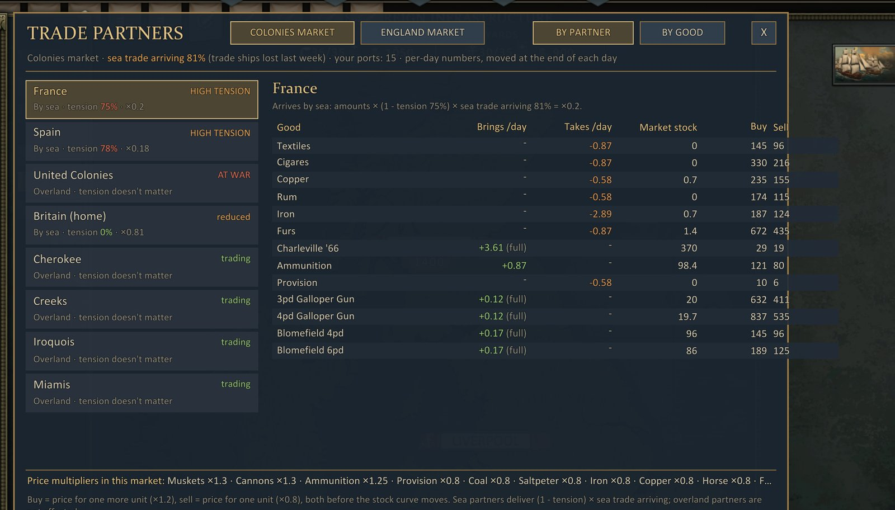

# UGAR Trade Partners

Shows the trade the game runs behind your markets: the 8 partner nations, what each brings to or takes from the market
every day, what is blocked and why, stock limits and prices. It's read-only and changes nothing in the game or your
save.

## How markets work

Every market has 8 trade partners, one per nation: France, Spain, United Colonies, Britain, Cherokee, Creeks, Iroquois
and Miamis. You never trade with them directly. Each day they **add goods to the market's stock** (what they offer)
and **take goods out** (what they demand). The market price you see follows that stock. The game only hints at this in
the Diplomacy tab; this window shows all of it.

- Sea partners' amounts are reduced by their **tension** with you and by **trade ships lost** last week. Overland
  partners always trade at full amounts.
- War, no ports and high tension show up as warnings, but only tension and lost ships actually change the amounts.
- Partners stop filling a good at its storage limit. Prices follow the stock, times the market's own multiplier;
  buying costs ×1.2 and selling pays ×0.8 of that.

## How to open it

- On the market screen: the **PARTNERS** tab, after the game's page tabs. It opens on the market you're looking at.
  Click it again to close.
- Anywhere on the campaign map: **F6** (setting `General.Hotkey`). **Esc** or **X** closes it.
- When there's room, the window docks to the right of the market screen; otherwise it's centred. It catches clicks, so
  nothing reaches the map.

## What it shows

- **BY PARTNER**: the 8 partners, each with its route (sea or overland), its tension with you and the factor its
  amounts are multiplied by, and a status tag: trading, reduced, HIGH TENSION, AT WAR, NO PORTS, or no trade here.
  Click a partner to see what it brings and takes per day, plus the market's stock and buy/sell price for each good.
- **BY GOOD**: every good the market trades or holds, with in, out and net per day, stock and its storage limit,
  buy and sell price, the market's price multiplier, and who supplies and buys it.
- **PRICE HISTORY**: pick a good on the left, or click any row in the other two views. The chart shows the buy price
  (gold) and sell price (green) per game day, with stock as faint bars; ranges are 30 days, 90 days, 1 year and all.
  The game keeps no history, so the mod records each market once per game day, starting when you install it.
- **COLONIES / ENGLAND** (Britain only): switch between the two markets. For example, tea is offered only in England.
- The footer lists the market's price multipliers and explains the formulas.

## Settings (F8)

Also in `BepInEx\config\ugar.tradepartners.cfg`.

| Setting | Default | What it does |
|---|---|---|
| `General.Enabled` | true | Show the PARTNERS tab and enable the hotkey. |
| `General.Hotkey` | F6 | Key that opens and closes the window (a Unity KeyCode name, e.g. F6, T). |
| `Window.Scale` | 1 | Window size, 0.5 to 3 (advanced). |
| `History.Record` | true | Record prices daily for the PRICE HISTORY view. |
| `Debug.VerifyLog` | true | Each day, log a line comparing the window's prediction with what the game moved (advanced). |

## Price history files

History is kept in `BepInEx\config\ugar.tradepartners-history\<nation>.tsv` (up to about 3 years per good). Saves
have no id, so loading an earlier save drops the recorded days from that date on: the history follows the timeline you
play. Delete the folder to start over.

## Compatibility

- Read-only, so it's safe to add or remove at any time; saves are not affected.
- The window doesn't show the weekly trimming of stock that sits far above its price-based limit.

## Troubleshooting

Look in `BepInEx\LogOutput.log` for lines from `UGAR Trade Partners`:

- `Trade Partners tab added to the market screen.` If you see `Trade Partners tab not added` or
  `Market screen tabs have nothing to copy` instead, the F6 hotkey still works.
- `Trade check (...)`: with `Debug.VerifyLog` on, "N/N goods matched" means the window's numbers are exact;
  mismatches are listed as predicted/actual.
- If the window closes itself after an error, press the hotkey to re-enable it, and include the log when reporting.
